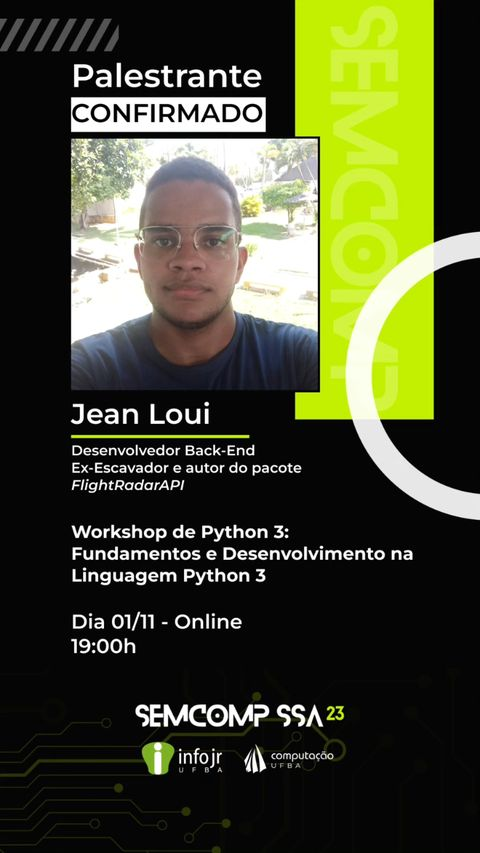

# Python Workshop (SEMCOMP 2023):
This repository contains my slides and source code of the project created during my presentation at the Python Workshop for the [SEMCOMP 2023](https://www.instagram.com/p/CwP4QEFA1gF/?hl=en).

### About the Workshop:
The goal of the workshop is introducing people to the Python programming language by covering its history, uses, benefits, current market situation, syntax, and tools. Following that, to provide a practical example, we create a project from scratch using the Flask framework.

### About the Python Project:
The project consists of a Flask application for editing metadata of music files, such as song cover, album name, and others. We also automated the retrieval of the music release year information by scraping details from its Wikipedia page. To accomplish this, we used the BeautifulSoup, music-tag and wikipedia libraries.

Install the dependencies of the project by typing the command below:
```
pip install -r requirements.txt
```


